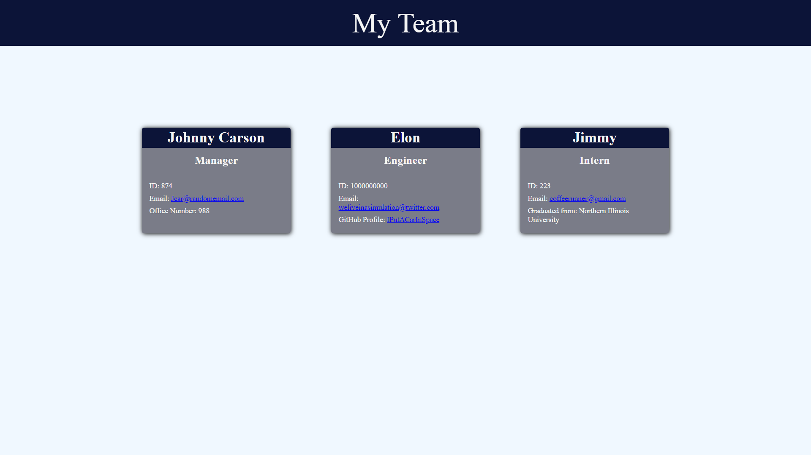

# Team-Profile-Generator
An application that will generate a profile for each team member of a users organization.
Each team profile includes the employee's name, ID number, email, and either office number, GitHub profile, or college graduated from.

This application allows for teams of up to 4 to be built consisting of a manager, one or two engineers, and an intern.

This application was built for node.js.

